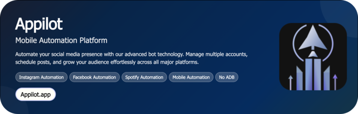

# YouTube Video Metadata Scraper

The **YouTube Video Metadata Scraper** automates the extraction of titles, tags, and descriptions from YouTube videos using Appilot’s Android automation and Selenium workflows. It helps creators and agencies collect structured metadata for trend analysis, keyword optimization, and content strategy enhancement.

  

  &nbsp;
  &nbsp;
  &nbsp;
  

 
   Created by Appilot, built to showcase our approach to Automation! 
   <strong>If you are looking for custom YouTube Video Metadata Scraper, you've just found your team — Let’s Chat.👆👆</strong>

## Introduction
The **YouTube Video Metadata Scraper** automates the process of fetching essential video data like titles, tags, and descriptions from popular or target videos.  
It eliminates the manual effort of copying metadata for SEO analysis or competitor research.  
By automating metadata collection, it helps content creators and marketers refine their video titles, improve discoverability, and align strategies with high-performing content.

### Automating YouTube Metadata Collection
- Extracts metadata directly from search results or video URLs.
- Organizes video titles, tags, and descriptions into structured data formats (CSV/JSON).
- Ideal for keyword research, SEO optimization, and performance benchmarking.
- Works on both real Android devices and emulators for realistic interaction.
- Supports bulk scraping from playlists, channels, or trending feeds.

## Core Features

- **Real Devices and Emulators:** Supports automation on both physical Android phones and emulators via Appilot for true-to-life behavior.
- **No-ADB Wireless Automation:** Uses Appilot’s non-ADB interface to perform UI operations without developer mode or root access.
- **Mimicking Human Behavior:** Scrolls, waits, and interacts with YouTube naturally to avoid detection or throttling.
- **Multiple Accounts Support:** Scrape metadata from videos using multiple logged-in profiles for variety in recommendations and exposure.
- **Multi-Device Integration:** Coordinate multiple devices to extract large-scale metadata batches in parallel.
- **Exponential Growth for Your Account:** Use scraped metadata insights to design SEO-optimized content, improving visibility and ranking.
- **Premium Support:** Get continuous updates, bug fixes, and custom feature implementations from the Appilot team.

| Feature | Description |
|----------|-------------|
| **Batch Scraping** | Collect metadata from hundreds of videos using search terms, playlists, or channel links. |
| **Export Formats** | Export data in CSV, JSON, or Excel for integration with analytics tools. |
| **Keyword Frequency Analysis** | Auto-count recurring words across titles and tags to identify high-performing keywords. |
| **Scheduler Integration** | Schedule scraping sessions at intervals to keep your dataset updated with new uploads. |
| **Proxy & Fingerprint Handling** | Use rotating proxies and device fingerprints for safe and undetected operations. |
| **Centralized Dashboard** | Manage tasks, devices, and export logs through an Appilot dashboard interface. |
| **Data Deduplication** | Prevent duplicate entries and ensure clean datasets during batch runs. |
| **Error Logging & Recovery** | Logs errors and retries failed scrapes automatically. |

  

## How It Works

1. **Input or Trigger:** The user provides a list of YouTube URLs, channel names, or search queries via the Appilot dashboard.  
2. **Core Logic:** Appilot uses UI Automator or Selenium to navigate to each video, extract metadata (title, description, tags), and save it locally.  
3. **Output or Action:** Collected data is structured and stored as JSON or CSV files, ready for analytics or import into keyword tools.  
4. **Other Functionalities:** Retry logic, logging, deduplication, and scheduled runs ensure consistent, reliable operation.

## Tech Stack
**Language:** Python, Java, JavaScript  
**Frameworks:** Appium, UI Automator, Selenium, Robot Framework  
**Tools:** Appilot, Android Debug Bridge (ADB), Appium Inspector, Bluestacks, Nox Player, Scrcpy  
**Infrastructure:** Dockerized device farms, Cloud-based emulators, Proxy networks, Parallel Device Execution, Task Queues

## Directory Structure

    youtube-metadata-scraper/
    │
    ├── src/
    │   ├── main.py
    │   ├── automation/
    │   │   ├── metadata_scraper.py
    │   │   ├── scheduler.py
    │   │   └── utils/
    │   │       ├── logger.py
    │   │       ├── proxy_manager.py
    │   │       └── config_loader.py
    │
    ├── config/
    │   ├── settings.yaml
    │   ├── credentials.env
    │
    ├── logs/
    │   └── activity.log
    │
    ├── output/
    │   ├── videos_metadata.csv
    │   └── report.json
    │   
    ├── requirements.txt
    └── README.md

## Use Cases
- **YouTube Creators** use it to extract metadata from competitors’ videos to identify trending tags and improve SEO.  
- **Digital Agencies** use it to build datasets for optimizing video descriptions across client channels.  
- **Data Analysts** use it to track content strategy shifts in specific niches.  
- **Automation Engineers** integrate it into larger marketing intelligence systems.  

## FAQs
**How do I configure scraping for multiple channels?**  
Use a CSV list of channel URLs as input — the system will iterate through each and scrape video metadata in bulk.

**Does it support proxy rotation or anti-detection?**  
Yes, it supports rotating proxies and device fingerprints through Appilot’s secure connection layer.

**Can I schedule recurring scrapes?**  
Absolutely. The scheduler module allows time-based or event-based executions.

**Is output format customizable?**  
Yes, you can select between JSON, CSV, or Excel formats for data export.

**Does it require API keys?**  
No — it uses front-end automation instead of YouTube’s official API, ensuring unrestricted data access.

## Performance & Reliability Benchmarks
- **Execution Speed:** Scrapes ~80–100 videos/minute on a single device.  
- **Success Rate:** 95% average across multi-device operations.  
- **Scalability:** Supports up to 500 concurrent Android devices or emulators.  
- **Resource Efficiency:** Low CPU overhead; runs efficiently on mid-range devices.  
- **Error Handling:** Automatic retries, adaptive backoff, and detailed log reporting ensure stable performance.

##

